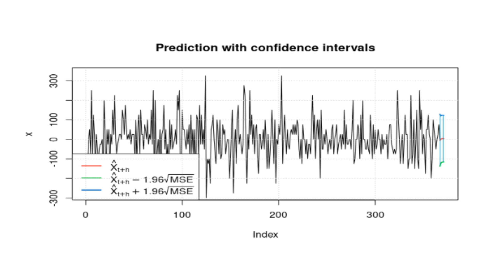

# Time Series Analysis with ARCH Model

## 📊 Project Overview 
Proyek ini menganalisis volatilitas harga saham Bank BCA (BBCA.JK) menggunakan model deret waktu ARCH. Studi kasus dilakukan pada periode 1 Januari 2013 - 30 November 2023, dengan tujuan memahami dinamika volatilitas dan mengukur risiko pasar berdasarkan fluktuasi harga historis.

## 📘 ARCH? 
ARCH adalah model deret waktu yang digunakan untuk memodelkan varians residual yang berubah-ubah (heteroskedastisitas). Model ini menangkap pola volatility clustering, yaitu kecenderungan volatilitas tinggi diikuti volatilitas tinggi berikutnya. Dalam konteks harga saham, ARCH membantu investor, trader, dan regulator memahami pola risiko jangka pendek dan memantau stabilitas pasar secara lebih akurat.

## 📉 Data Source
Data harga saham Bank BCA yang diperoleh dari Yahoo Finance dengan detail berikut:
- Periode: 1 Januari 2013 - 30 November 2023 
- Frekuensi: Harian
- Variabel: Date, Close

## 📑 Conclusion

  

Pendekatan awal menggunakan ARIMA(0,1,2) menunjukkan adanya heteroskedastisitas, sehingga model tersebut kurang sesuai untuk memodelkan volatilitas. Model ARCH(8) kemudian dipilih karena memberikan performa terbaik berdasarkan nilai AIC dan BIC.

Hasil pemodelan menunjukkan bahwa volatilitas harga saham Bank BCA pada 1 Desember 2023 berada pada tingkat yang cukup tinggi. Tingginya volatilitas—yang direpresentasikan oleh standar deviasi yang besar—mengindikasikan meningkatnya risiko pergerakan harga. Dengan demikian, prediksi volatilitas tersebut memberi sinyal bahwa saham BCA pada periode tersebut berada dalam kondisi pasar yang relatif berisiko bagi investor.

Detail analisis dapat ditemukan pada paper lengkap di tautan berikut: https://ojs3.unpatti.ac.id/index.php/variance/article/view/13026

## 🛠 Prerequisites
Sebelum menjalankan kode analysis ini pastikan beberapa hal berikut sudah terinstall: 
- R (version 4.0 or higher)
- RStudio (optional but recommended)
- Required R packages: `quantmod`, `tseries`, `forecast`, `rugarch`, `ggplot2`
